# Neural_Network_Charity_Analysis

## Overview of the analysis

### Purpose
 Create a binary classifier that is capable of predicting whether applicants will be successful if funded by Alphabet Soup.

From Alphabet Soup’s business team,  received a CSV containing more than 34,000 organizations that have received funding from Alphabet Soup over the years. Within this dataset are a number of columns that capture metadata about each organization.
### Data

Customer provided csv file of past funding efforts.(charity_data.csv)
* EIN and NAME—Identification columns
* APPLICATION_TYPE—Alphabet Soup application type
* AFFILIATION—Affiliated sector of industry
* CLASSIFICATION—Government organization classification
* USE_CASE—Use case for funding
* ORGANIZATION—Organization type
* STATUS—Active status
* INCOME_AMT—Income classification
* SPECIAL_CONSIDERATIONS—Special consideration for application
* ASK_AMT—Funding amount requested
* IS_SUCCESSFUL—Was the money used effectively
What You're Creating

### Deliverables

* Deliverable 1: Preprocessing Data for a Neural Network Model
* Deliverable 2: Compile, Train, and Evaluate the Model
* Deliverable 3: Optimize the Model
* Deliverable 4: A Written Report on the Neural Network Model (README.md)

## Results

### Diliverable 1:

  - Data Preprocessing

    - variables considered as the features and targets for the model

    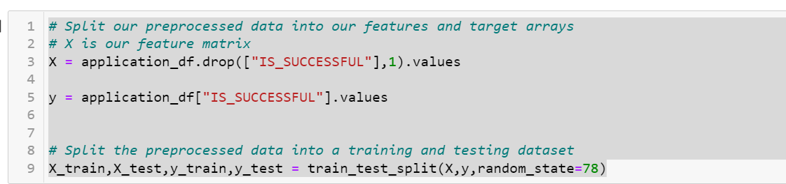

    - variables  neither targets nor features, and removed from the input data?

    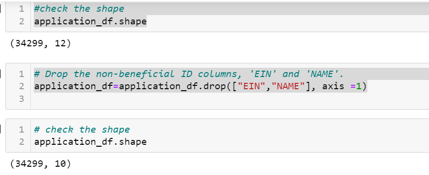

### Diliverable 2:

 - Compiling, Training, and Evaluating the Model

    - Neurons,layers and activation function selected for Nural network model

    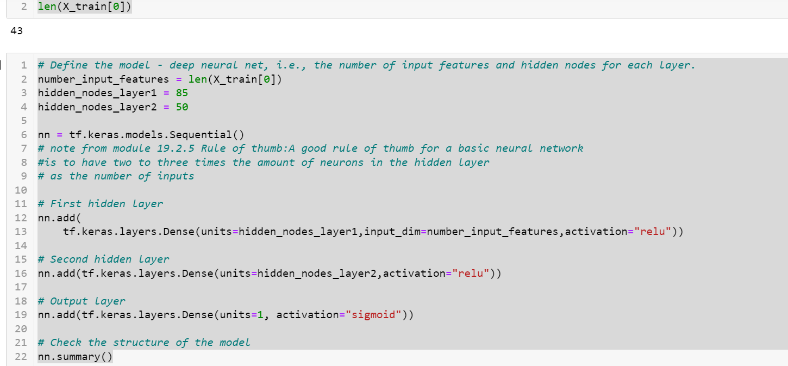

     
     -  why?
       
        - A good rule of thumb for a basic neural network is to have two to three times the amount of neurons in the hidden layer as the number of inputs.

        - As output activation function I chose "sigmoid",because our output only has two choises.
          
          i.e: whether applicants will be successful or not if funded by Alphabet Soup.

    - Model Performence

     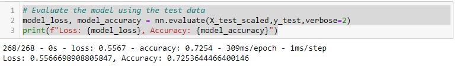

    

    - So the model does not achieve the target performence 75%

      
### Diliverable 3

### 1st Attempt:

reference: AlphabetSoupCharity_Optimzation_D3_1.ipynb

#### Steps take to increase model performance

- Drop the columns "STATUS" and "SPECIAL_CONSIDERATIONS"

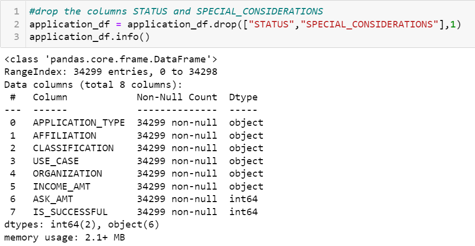

- Adeed third hidden layer with activation function "relu".

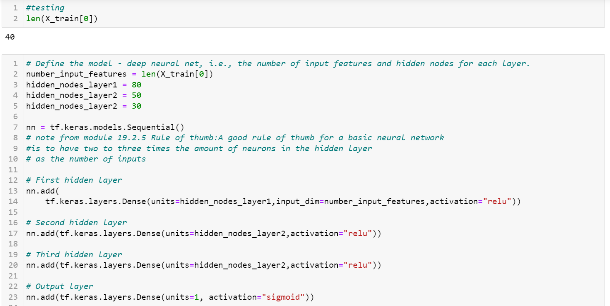

- Model accuracy level

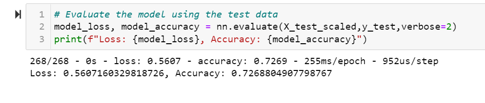

   - with incresed the accuracy level to 72.68 % but it did not achieved the target 75%.

### 2nd Attempt:
reference: AlphabetSoupCharity_Optimzation_D3_2.ipynb

#### Steps take to increase model performance

- this time I Only drop the column "EIN"
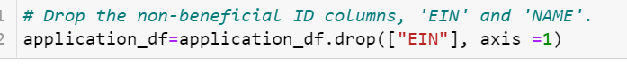

- Use bucket s to catogerize column "NAME"

  - If Name column counts are less than or eaqual 1 replace it with bucket "No Repeat"

   -  If Name column counts are less than or eaqual 5 replace it with bucket "In Frequent"

   -   If Name column counts are less than or eaqual 100 replace it with bucket "Frequent"

   -   If Name column counts are greater than 100 replace it with bucket "Frequent"

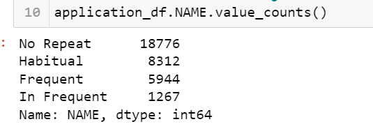

- Created OneHotEncoder instance for catogerical columns including column "NAME"

- Added extra hidden layer with 20 nueron

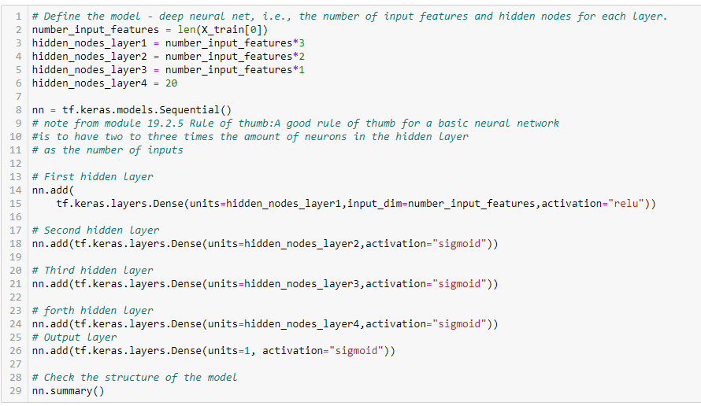

- Accuracy level

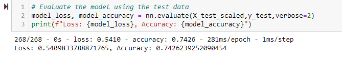

Still with above changes this model gave accoracy level 74%

### 3rd Attempt:

- this time I only used 1 bucket(other) for column "NAME".

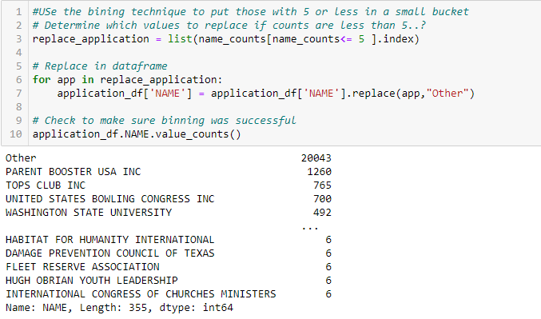

- With above bucket selection now we have after one-hot encoded, 396 columns

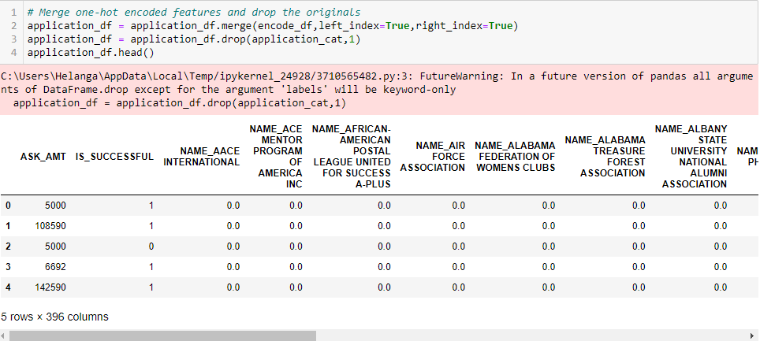

- Used the same Nurelnetwork model as above 2nd attempt

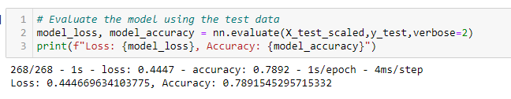

from this 3rd attempt with meaningfully buckerted "NAME" column got accuracy level 78%.

### Examin Random Forest Classifier for comparison

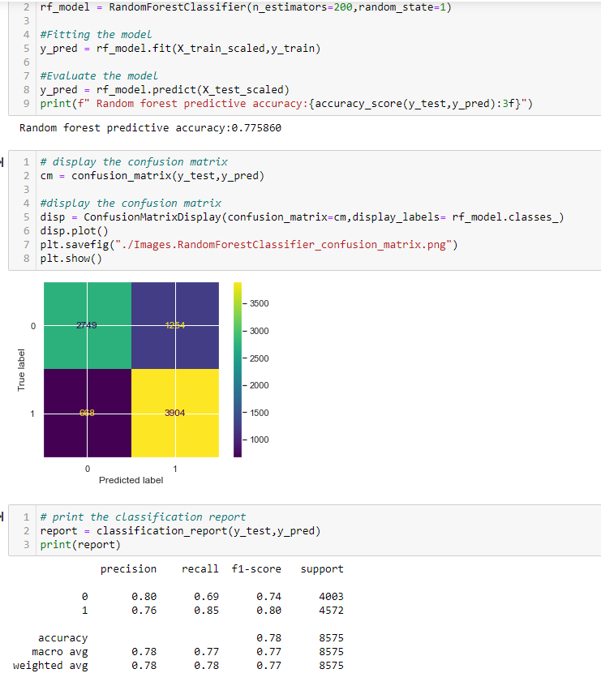

So the Random forest classifier got accuracy of 77.85% almost 78% with 80% F1 score for successful application.

  if we compare both model's predictive accuracy, their output is very similar. Both the random forest and deep learning models were able to predict correctly whether a applicants will be successful 78%  of the time. 
  
  Although their predictive performance was comparable, their implementation and training times were not—the random forest classifier was able to train on the large dataset and predict values in seconds, while the deep learning model required a couple minutes to train on the tens of thousands of data points. 
## Summary
When comparing three attempt to optimize nural network classifier models,after buckerting column "NAME" in useful way the model gave more than 78% accuracy level with 4 hidden layers.

The random forest model is able to achieve comparable predictive accuracy on large tabular data with less code and faster performance.

Other than that random forest model gives list of features by their importance

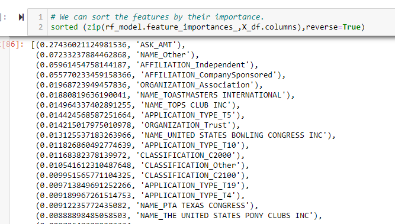

this feature importence list also give idea how impotant the column NAME to this data set.

Considering above all facts we can recomend Random Forest classifier is the best model to  predict whether applicants will be successful if funded by Alphabet Soup.